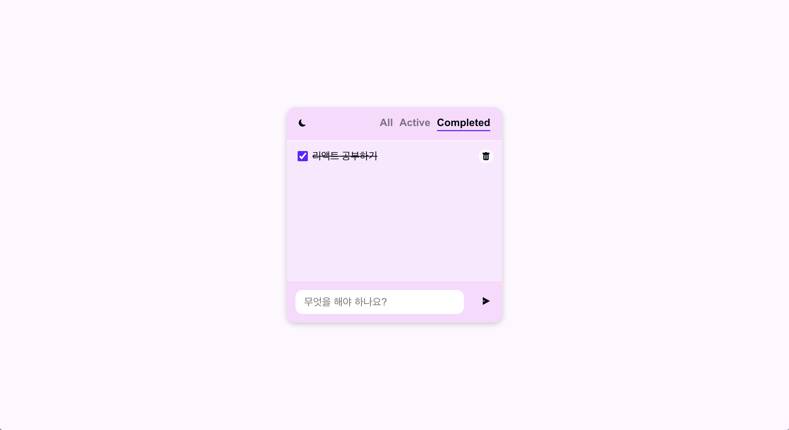

# React를 이용한 TODO Project

  
  

## 주요기능
1. 할 일 입력
2. 할 일 삭제
3. 완료한 일 체크
4. 전체 / 아직 하지 않은 일 / 완료한 일 필터링해서 보기
5. 라이트 모드 / 다크 모드 테마
6. 로컬스토리지에 할 일들과 테마 저장하여 기억

## 기술 스택

 

## 스크린샷
1. 라이트 모드 / 다크모드 테마 : 사용자의 브라우저 초기 설정값을 따라가도록 설정
 
 
2. 할 일을 입력하고 다 한 일은 체크 표시 가능
 
3. 해야 할 일(Active)와 완료한 일(Completed)을 구분하여 볼 수 있음
 
 
4. 새로운 할 일을 입력하였을 때 스크롤이 제일 밑으로 내려가서 방금 입력한 할 일을 바로 볼 수 있음
 
5. 필요하지 않은 항목은 휴지통 버튼을 클릭하여 삭제할 수 있음
 
1. 할 일들과 테마를 로컬스토리지에 저장하여 화면을 refresh하거나 다시 들어와도 이전에 입력해 둔 할 일들과 테마를 그대로 보여줌 
 
